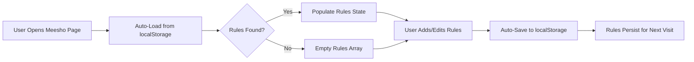

# LocalStorage Usage Documentation

## Overview

This document describes all data stored in `localStorage` by the PDF Things Next application, specifically for the Meesho e-commerce SKU sorting feature.

---

## Storage Keys

### 1. `meesho-sku-replacement-rules`

**Purpose:** Stores user-defined SKU replacement rules for multi-account normalization in Meesho label sorting.

**Data Type:** Array of objects (JSON)

**Structure:**
```typescript
SKUReplacementRule[] = [
  {
    from: string;           // Pattern to search for (e.g., "seller1-")
    to: string;             // Pattern to replace with (e.g., "main-")
    useRegex?: boolean;     // Whether to use regex matching (optional)
    caseSensitive?: boolean; // Whether matching is case-sensitive (optional)
  }
]
```

**Example Value:**
```json
[
  {
    "from": "seller1-",
    "to": "main-",
    "caseSensitive": true
  },
  {
    "from": "seller2-",
    "to": "main-",
    "caseSensitive": true
  },
  {
    "from": "alt-",
    "to": "main-",
    "caseSensitive": true
  }
]
```

**Where It's Used:**

| File | Location | Purpose |
|------|----------|---------|
| [`src/app/ecommerce/meesho/MeeshoEcomList.tsx`](file:///e:/VIVEK/froentend/private/pdf_things_next/src/app/ecommerce/meesho/MeeshoEcomList.tsx) | Lines 42-62 | **Auto-load** on component mount |
| [`src/app/ecommerce/meesho/MeeshoEcomList.tsx`](file:///e:/VIVEK/froentend/private/pdf_things_next/src/app/ecommerce/meesho/MeeshoEcomList.tsx) | Lines 64-76 | **Auto-save** when rules change |
| [`src/components/SKURuleManager.tsx`](file:///e:/VIVEK/froentend/private/pdf_things_next/src/components/SKURuleManager.tsx) | Lines 62-64 | Manual save via "Save Rules" button |
| [`src/components/SKURuleManager.tsx`](file:///e:/VIVEK/froentend/private/pdf_things_next/src/components/SKURuleManager.tsx) | Lines 66-80 | Manual load via "Load Saved" button |

**Lifecycle:**



**Persistence Behavior:**

- ✅ **Auto-saves** whenever rules are added, edited, or removed
- ✅ **Auto-loads** when the Meesho page loads
- ✅ **Persists** across browser sessions
- ✅ **Survives** page refreshes
- ❌ **Lost** if user clears browser data
- ❌ **Lost** if user uses incognito/private mode

---

## Implementation Details

### Auto-Load Implementation

**File:** `src/app/ecommerce/meesho/MeeshoEcomList.tsx`

```typescript
// Auto-load SKU rules from localStorage on mount
useEffect(() => {
    const loadRulesFromStorage = () => {
        try {
            const saved = localStorage.getItem('meesho-sku-replacement-rules');
            if (saved) {
                const parsed = JSON.parse(saved);
                if (Array.isArray(parsed) && parsed.length > 0) {
                    setReplacementRules(parsed);
                    console.log(`✅ Loaded ${parsed.length} SKU rule(s) from localStorage`);
                }
            }
        } catch (error) {
            console.error('Failed to load SKU rules from localStorage:', error);
        }
    };
    
    loadRulesFromStorage();
}, []); // Run once on mount
```

### Auto-Save Implementation

**File:** `src/app/ecommerce/meesho/MeeshoEcomList.tsx`

```typescript
// Auto-save rules to localStorage whenever they change
useEffect(() => {
    if (replacementRules.length > 0) {
        try {
            localStorage.setItem('meesho-sku-replacement-rules', JSON.stringify(replacementRules));
            console.log(`💾 Auto-saved ${replacementRules.length} SKU rule(s) to localStorage`);
        } catch (error) {
            console.error('Failed to save SKU rules to localStorage:', error);
        }
    }
}, [replacementRules]); // Run whenever rules change
```

---

## User Experience

### First Visit

1. User visits Meesho page
2. No rules in localStorage → Empty rules array
3. User adds rules via SKU Normalization Settings panel
4. Rules automatically save to localStorage
5. **Message in console:** `💾 Auto-saved 3 SKU rule(s) to localStorage`

### Subsequent Visits

1. User visits Meesho page
2. Rules automatically load from localStorage
3. **Message in console:** `✅ Loaded 3 SKU rule(s) from localStorage`
4. Settings panel shows "(3 rules active)"
5. User can immediately use saved rules or edit them

### Editing Rules

1. User expands SKU Normalization Settings panel
2. User adds/edits/removes rules
3. Each change automatically saves to localStorage
4. **Message in console:** `💾 Auto-saved 4 SKU rule(s) to localStorage`

---

## Manual Save/Load (Backup)

While auto-save/load is active, users can still manually save and load rules using the buttons in `SKURuleManager`:

- **"Save Rules" button:** Manually saves current rules with confirmation alert
- **"Load Saved" button:** Manually reloads rules from localStorage with confirmation alert

These are useful for:
- Confirming rules were saved
- Reloading rules if accidentally deleted
- User peace of mind

---

## Storage Size

**Estimated Size per Rule:** ~100-150 bytes

**Example Storage Usage:**

| Number of Rules | Approximate Size |
|----------------|------------------|
| 1 rule | ~120 bytes |
| 5 rules | ~600 bytes |
| 10 rules | ~1.2 KB |
| 50 rules | ~6 KB |
| 100 rules | ~12 KB |

**Browser Limits:** 
- Most browsers allow 5-10 MB per domain for localStorage
- SKU rules use negligible space

---

## Error Handling

### JSON Parse Errors

If localStorage data is corrupted:
```javascript
try {
    const parsed = JSON.parse(saved);
} catch (error) {
    console.error('Failed to load SKU rules from localStorage:', error);
    // Gracefully continues with empty rules
}
```

### Storage Quota Exceeded

If localStorage is full (rare):
```javascript
try {
    localStorage.setItem('meesho-sku-replacement-rules', JSON.stringify(rules));
} catch (error) {
    console.error('Failed to save SKU rules to localStorage:', error);
    // User can still use rules in current session
}
```

---

## Privacy & Security

### What's Stored
- ✅ Non-sensitive: SKU pattern strings (e.g., "seller1-", "main-")
- ✅ No user credentials
- ✅ No personal information
- ✅ No PDF content
- ✅ No file names

### Security Considerations
- ✅ **Client-side only:** Never sent to server
- ✅ **Domain-isolated:** Only accessible by your domain
- ✅ **User-controlled:** Can be cleared via browser settings
- ⚠️ **Unencrypted:** Stored in plain text (safe for non-sensitive data)

---

## Debugging

### View Current Rules in Console

```javascript
// View current rules
const rules = localStorage.getItem('meesho-sku-replacement-rules');
console.log(JSON.parse(rules));
```

### Clear Rules

```javascript
// Clear all SKU rules
localStorage.removeItem('meesho-sku-replacement-rules');
```

### View All localStorage Data

```javascript
// View all localStorage keys
console.log(Object.keys(localStorage));

// View all localStorage data
for (let i = 0; i < localStorage.length; i++) {
    const key = localStorage.key(i);
    console.log(key, localStorage.getItem(key));
}
```

---

## Browser Compatibility

| Browser | localStorage Support | Auto-Save/Load Works |
|---------|---------------------|---------------------|
| Chrome 4+ | ✅ | ✅ |
| Firefox 3.5+ | ✅ | ✅ |
| Safari 4+ | ✅ | ✅ |
| Edge (All versions) | ✅ | ✅ |
| Opera 10.5+ | ✅ | ✅ |
| Mobile Safari | ✅ | ✅ |
| Chrome Mobile | ✅ | ✅ |

**Note:** localStorage is supported by all modern browsers.

---

## Migration & Updates

### Future localStorage Keys

If additional features are added, use this naming pattern:

```
meesho-[feature-name]-[data-type]
```

Examples:
- `meesho-crop-preferences`
- `meesho-user-settings`
- `meesho-recent-files` (if added)

### Version Management

Currently, no versioning is needed. If schema changes in future:

```typescript
interface SKUReplacementRuleV2 {
    from: string;
    to: string;
    useRegex?: boolean;
    caseSensitive?: boolean;
    version: 2; // Add version field
}
```

---

## Testing

### Test Auto-Save

1. Open Meesho page
2. Open browser console (F12)
3. Add a rule via UI
4. Check console for: `💾 Auto-saved 1 SKU rule(s) to localStorage`
5. Verify in Application/Storage tab of DevTools

### Test Auto-Load

1. Add rules and let them save
2. Refresh the page (F5)
3. Check console for: `✅ Loaded X SKU rule(s) from localStorage`
4. Verify rules appear in UI

### Test Persistence

1. Add rules
2. Close browser completely
3. Reopen browser and navigate to Meesho page
4. Rules should still be present

---

## Summary

- **Key:** `meesho-sku-replacement-rules`
- **Purpose:** Persist SKU replacement rules between sessions
- **Type:** JSON array of rule objects
- **Behavior:** Auto-save on change, auto-load on mount
- **Location:** Used in `MeeshoEcomList.tsx` and `SKURuleManager.tsx`
- **Privacy:** Non-sensitive data, client-side only
- **Size:** Minimal (~100 bytes per rule)
- **Support:** All modern browsers

---

**Last Updated:** 2026-01-01

**Related Files:**
- [`src/app/ecommerce/meesho/MeeshoEcomList.tsx`](file:///e:/VIVEK/froentend/private/pdf_things_next/src/app/ecommerce/meesho/MeeshoEcomList.tsx)
- [`src/components/SKURuleManager.tsx`](file:///e:/VIVEK/froentend/private/pdf_things_next/src/components/SKURuleManager.tsx)
- [`src/hooks/useSortPdf.ts`](file:///e:/VIVEK/froentend/private/pdf_things_next/src/hooks/useSortPdf.ts)
